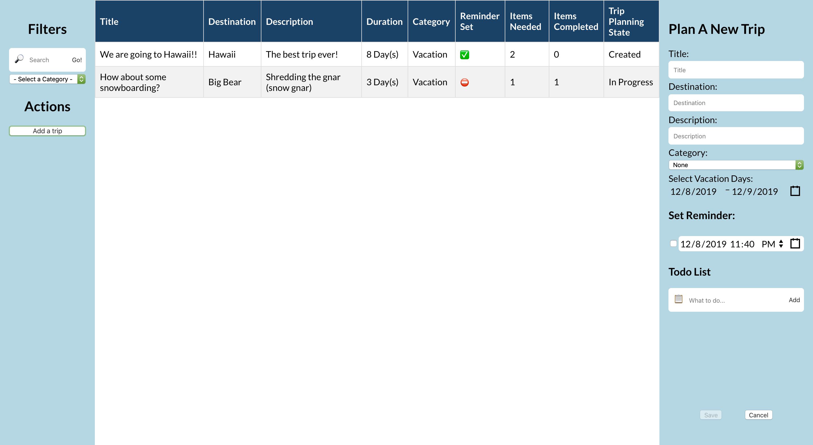

# Trip Planner 📋

This is the SPA Trip Planner Coding Challenge provided by [Stamps.com](https://www.stamps.com/).

To not reveal any licensed documents, I will refrain from sharing any sensitive information about the process of this coding challenge.

## Screenshot

 _Single page view with sample data_

## Special Thanks

I wanted to give special thanks to some open-source libraries used for this project that made my life so much easier:

- [React](https://reactjs.org/) - Wonderful UI Library
- [Wojciech Maj's Time Creations](http://projects.wojtekmaj.pl/react-daterange-picker/) - Calendar Widgets
- [SweetAlert2](https://sweetalert2.github.io/) - Awesome modern alerts
- [JsonWebToken](https://www.npmjs.com/package/jsonwebtoken) - (exactly what it stands for)
- [UUID](https://www.npmjs.com/package/uuid) - (exactly what it stands for)
